# MEN-Stack-CRUD-App-Lab

  

  # NFL Team Application

  ##### Lucas Sloan

  
  

  ## :pencil: Description

 - Browse NFL Teams: Users can view a list of NFL teams with details like city, name, and image.
 - View Team Details: Clicking on a team’s name displays detailed information, including the team's image, city, name, and whether they are ready for playoffs.
 - Add New Teams: Users can add new NFL teams by providing details such as city, name, and playoff readiness. The app will automatically assign an image based on the team’s name.
 - Edit Team Information: Users can update the details of existing teams, including city, name, and playoff readiness.
 - Delete Teams: Users can remove teams from the list if they are no longer relevant or needed.

 ## :mountain: Background

 - I chose NFL Teams because I have been a fan of professional football since I was in Elementary School.
 - I enjoyed the challenge of adding images into the index and show pages.
 - The app involves building both the frontend (with EJS templates and CSS) and backend (using Express.js and MongoDB) to manage and display data about NFL teams, including functionality for adding, editing, viewing, and deleting teams.

  ## :camera_flash: Screenshots 

  | Description       | Screenshot                                                |
  |:-----------------:|-----------------------------------------------------------|
  | <h3>Landing Page</h3>  | 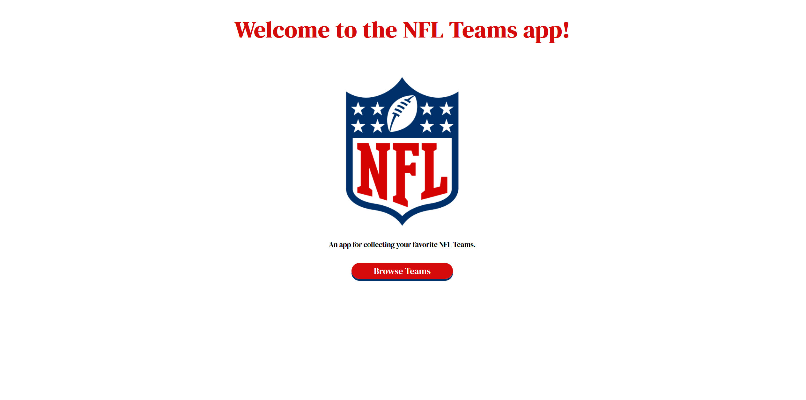       |
  | <h3>Team Page</h3> | 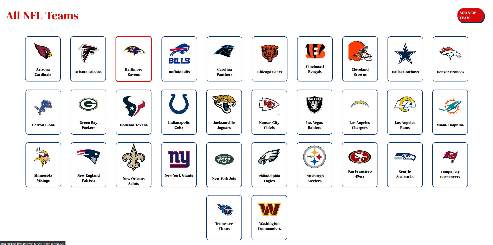 |
  | <h3>Show Page</h3> | 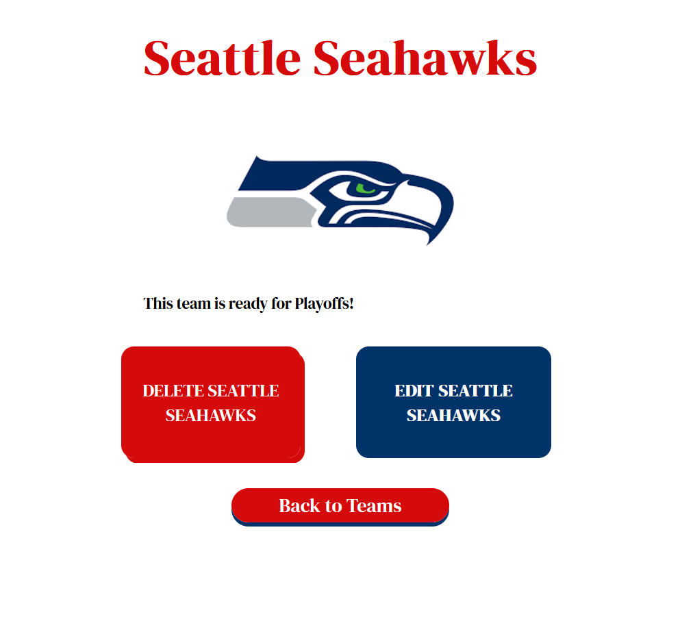 |
  | <h3>Add Page</h3> | 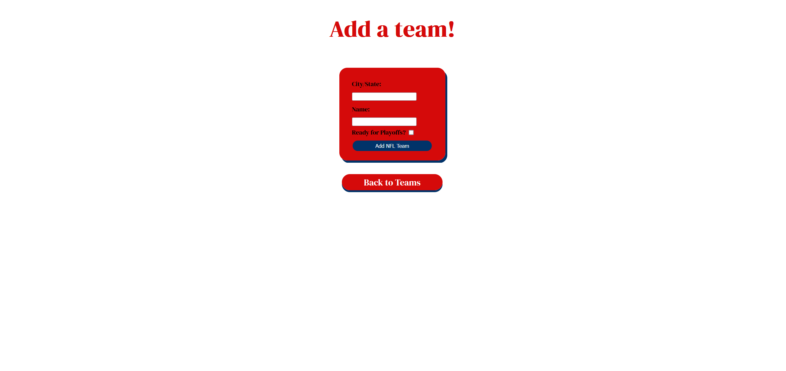 |
  | <h3>Edit Page</h3> | 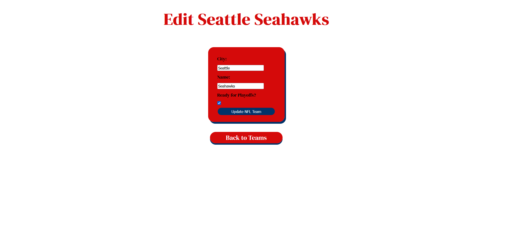 |

## :framed_picture: Assets
######  NFL Logos:

    
NFL

    

  

  
Cardinals

  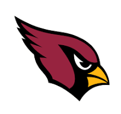

  
Falcons

  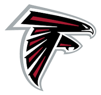

  
Ravens

  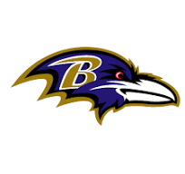

  
Panthers

  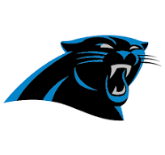

  
Bears

  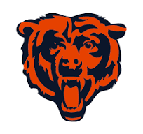

  
Bengals

  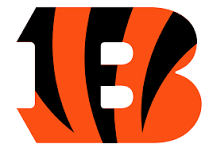

  
Browns

  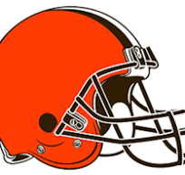

  
Cowboys

  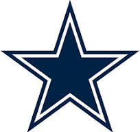

  
Broncos

  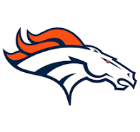

  
Lions

  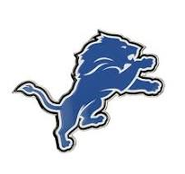

  
Packers

  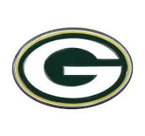

  
Texans

  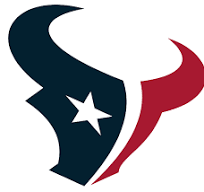

  
Colts

  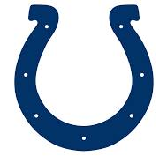

  
Jaguars

  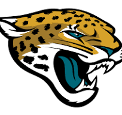

  
Chiefs

  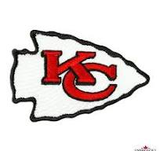

  
Raiders

  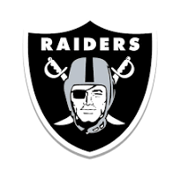

  
Chargers

  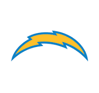

  
Rams

  

  
Dolphins

  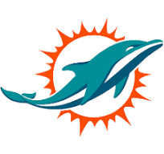

  
Vikings

  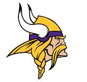

  
Patriots

  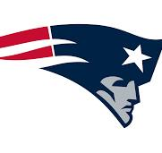

  
Saints

  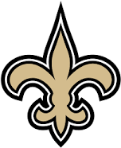

  
Giants

  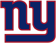

  
Jets

  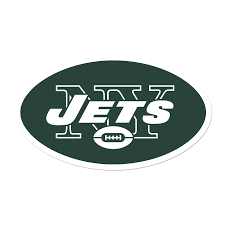

  
Eagles

  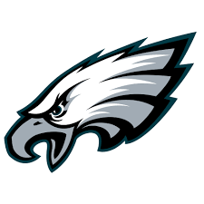

  
Steelers

  

  
49ers

  

  
Seahawks

  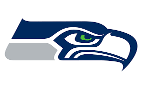

  
Buccaneers

  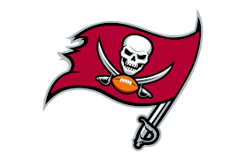

  
Titans

  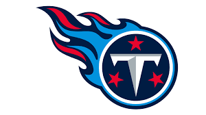

  
Commanders

  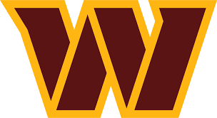

## :desktop_computer: Technologies Used

